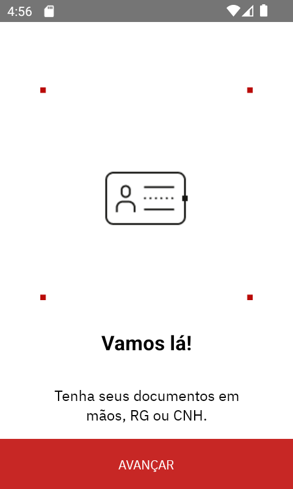
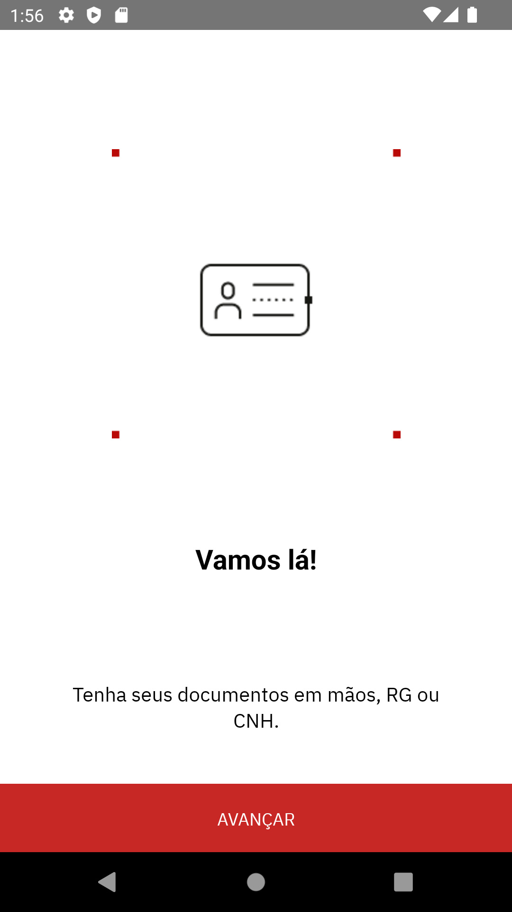
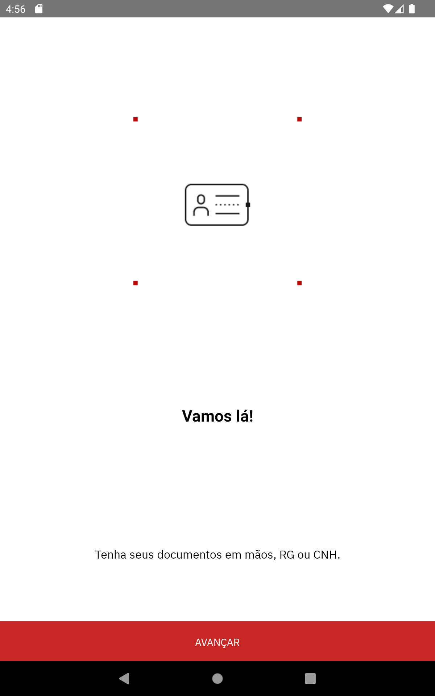

# BrScanOnboarding

## 💻 Pré-requisitos

Antes de começar, verifique se você atendeu aos seguintes requisitos:

<!---Estes são apenas requisitos de exemplo. Adicionar, duplicar ou remover conforme necessário--->

- Você esta utilizando a versão `v8.17.0` do node.
- Você tem na máquina o `Android studio` com um `Emulador`.

## 🚀 Instalando e executando BrScanOnboarding

Para instalar o BrScanOnboarding, siga estas etapas:

Baixar projeto:

```
git clone https://github.com/Trosdan/BrScanOnboarding.git
```

Entrar nas pasta do projeto e instalar as dependencias:

```
yarn
```

Rodar o projeto:

```
yarn react-native run-android
```

## 📱 Imagens do projeto (Comparativo de responsividade)

## Minimal 480x800:



---

## Phone 1080x1920



---

## Tablet 1200x1920


